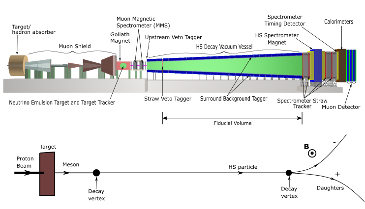

<h1 style="float: left;"> 
  SHiP - Bristol MSci Project Codes</h1>

 By D. Galbinski and N. Stylianou 

## Summary:
The SHiP project was a proposed fixed target experiment at CERN SPS, designed to use meson decays and proton bremsstrahlung to explore the hidden sector, which includes light long-lived particles predicted by various new particle physics models. This repository focused on particular final decay states in: the R-parity violating 
(RPV) neutralino,  heavy-neutral-lepton (HNL),and the dark photon (DP) model. The study presented that the design of this facility is sensitive to the detection of particles of these models through their particular visible final states. Furthermore, the resolution of different timing detectors is considered and the use of time-of-flight is proven to be an impractical particle identification method at SHiP.

### The SHIP Facility:
<figure style="text-align: center;">
  

  
    <figcaption style="text-align: center;">(Top) Overview of the current SHiP detector layout, which was taken from the output of the event display program, which is part of the FAIRSHIP software. (Bottom) Illustration of possible set of decays and tracks, where it indicates a magnetic field perpendicularly outwards of the plane of the page.</figcaption>
  

</figure>

### Details:
* `run_simScript.py` is a simulation script, which made use of Monte Carlo generators.
  * GEANT 4 is used to simulate the strusture and detectors, and track partiles.
  * PYTHIA is used to generate hep events, parton showers, parton-parton interactions and particle events.
* `ShipReco.py` is used to reconstruct the tracks of charged particles.
* Analysis scripts (eg. `ShipAna.py`, `RPV_editana.py`).
  * This is done for HNL, RPV and DP models.

